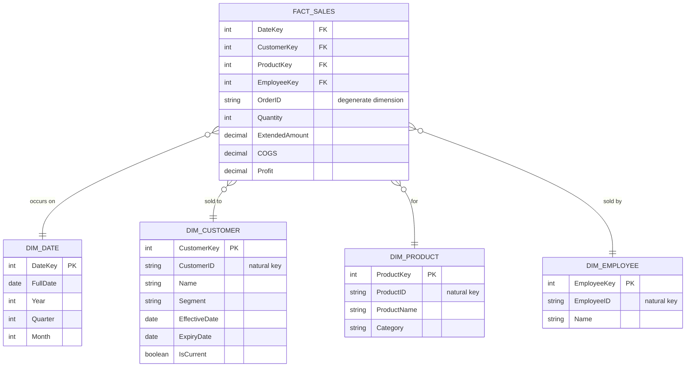
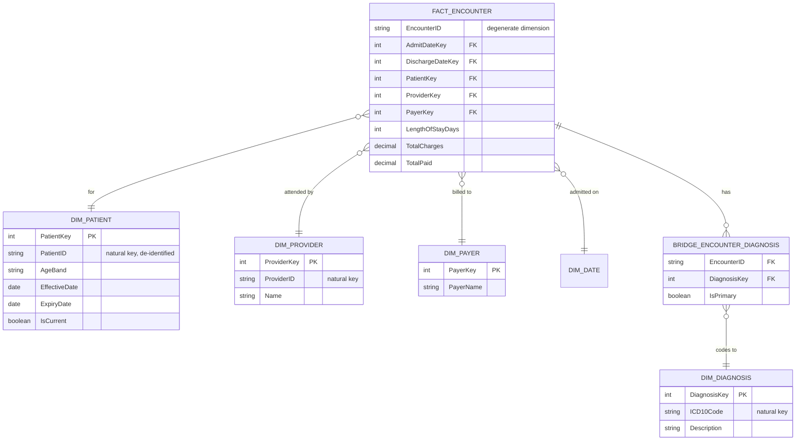

# Star Schema Redesign of Messy Datasets

**Skill demonstrated:** Dimensional modeling — turning denormalized, single-table data into a governed star schema with explicit grain, conformed dimensions, and documented modeling decisions.

This is the skill interviewers probe hardest for a BI/analytics role, because it's what separates someone who can build a chart from someone who can build a semantic layer other people trust. A flat table looks "done" the moment it loads into a BI tool — until someone asks for a metric that requires deduplication, a historical snapshot, or a join that silently fans out rows and doubles every total.

Two worked examples below — one commercial, one healthcare — each follow the same method:

1. **Identify the business process** being measured.
2. **Declare the grain** — the single, unambiguous definition of one fact-table row — *before* naming a single column.
3. **Identify the dimensions** that describe that grain.
4. **Identify the facts** (measures) that are true at that grain.

Skipping step 2 is the most common mistake in dimensional modeling, and the first thing a good interviewer checks for.

---

## Example 1 — E-Commerce Order Data

### The problem: a flat order extract

A typical export from an operational order system — one row per order line, every related entity flattened into it:

| OrderID | OrderDate | CustomerID | CustomerName | Segment | ProductID | ProductName | Category | EmployeeID | Quantity | UnitPrice | Discount |
|---|---|---|---|---|---|---|---|---|---|---|---|
| 10001 | 2024-01-03 | C204 | J. Farooq | Corporate | P0091 | Wireless Mouse | Electronics | E12 | 3 | 12.99 | 0.05 |
| 10001 | 2024-01-03 | C204 | J. Farooq | Corporate | P0113 | USB-C Hub | Electronics | E12 | 1 | 24.99 | 0.00 |
| 10002 | 2024-01-03 | C097 | A. Bhatti | Consumer | P0091 | Wireless Mouse | Electronics | E08 | 2 | 12.99 | 0.00 |

Customer, product, and employee attributes repeat on every line — correcting one customer's segment means updating potentially thousands of rows, inconsistently, across every report that touches it. There's also no way to track that a customer's segment *changed* — the flat file only ever shows the current value, so historical revenue-by-segment reporting silently rewrites itself the moment an attribute changes.

### The redesign

**Grain: one row per product line, per order.**

**Fact_Sales measures:**
- `Quantity`, `ExtendedAmount`, `COGS`, `Profit` — fully additive across every dimension.
- `UnitPrice`, `Discount` — non-additive; kept for audit, never summed.

### Why these choices

| Decision | Reasoning |
|---|---|
| Grain at line level, not order level | Aggregating up front loses the ability to answer "what's our margin on this specific product" — a question every product manager eventually asks. |
| `OrderID` as a degenerate dimension | It has no attributes of its own beyond the ID — a separate `Dim_Order` table would be an extra join for zero descriptive value. |
| `Dim_Customer` as SCD Type 2 | Segment and city tracked with effective-dated rows, so revenue-by-segment trending reflects what a customer's segment *was* at time of sale, not a retroactive rewrite of history. |
| `Dim_Product` as SCD Type 1 | Cosmetic corrections overwrite in place; a genuine category reclassification would be handled as Type 2 in a mature warehouse — a deliberate simplification worth naming out loud. |
| Surrogate keys throughout | Insulates the warehouse from source-system key reuse, and is what makes SCD Type 2 possible — one `CustomerID` needs to map to multiple surrogate keys over time. |
| Star, not snowflake | `Category` kept denormalized inside `Dim_Product` — low, stable cardinality means a snowflake's extra join buys nothing here. |
| Conformed dimensions | `Dim_Date` and `Dim_Customer` built for reuse by a future `Fact_Returns` table, enabling drill-across analysis without redefining "customer" twice. |

---

## Example 2 — Healthcare Patient Encounters

### The problem: a flat clinical/billing extract

A common export joins the patient, visit, provider, diagnosis, and billing systems into one row per encounter line:

| EncounterID | AdmitDate | DischargeDate | PatientID | ProviderID | ICD10Code | Diagnosis | PayerName | TotalCharges |
|---|---|---|---|---|---|---|---|---|
| E5510 | 2024-02-11 | 2024-02-13 | P8842 | DR221 | I10 | Essential hypertension | Sehat Card | 42,000 |
| E5510 | 2024-02-11 | 2024-02-13 | P8842 | DR221 | E11.9 | Type 2 diabetes | Sehat Card | 42,000 |
| E5511 | 2024-02-11 | 2024-02-11 | P9013 | DR118 | S06.0 | Concussion | Commercial | 15,200 |

One encounter can have multiple diagnoses (`E5510` appears twice), so `TotalCharges` **repeats and would double-count** if summed directly — the single most dangerous silent error a flat clinical extract can produce. Patient demographics and insurance are also captured as of extract time only — no way to answer "what payer was active when this encounter happened" if the patient later switched plans.

### The redesign

**Grain: one row per patient encounter — not per diagnosis.**

**Fact_Encounter measures:**
- `TotalCharges`, `TotalPaid` — fully additive, *only because the grain is fixed to one row per encounter.*
- `LengthOfStayDays` — semi-additive.

### Why these choices

| Decision | Reasoning |
|---|---|
| Grain fixed at one row per encounter | This single change is what fixes the double-counting bug in the source extract — the most common real-world reason a "simple" revenue total ends up wrong. |
| Bridge table for diagnoses | Multi-valued diagnoses handled via `Bridge_Encounter_Diagnosis` rather than repeating the fact row per diagnosis — preserves the additive grain while still allowing diagnosis-level analysis. |
| `Dim_Date` as a role-playing dimension | The same physical date table referenced twice (`AdmitDateKey`, `DischargeDateKey`) rather than two separate tables — holiday calendars and fiscal logic stay defined once. |
| `Dim_Patient` as SCD Type 2 | Insurance and address changes tracked with history — "which payer was active at time of service" is a compliance requirement, not a reporting nicety. |
| De-identified `Dim_Patient` | Only a surrogate key and non-identifying attributes (age band, not raw DOB) carried into the analytical layer — privacy-by-design built into the model, not bolted on later. |
| `Dim_Facility`/hierarchies left unsnowflaked | Small, stable cardinality — the extra join a snowflake would add buys nothing. |

---

## Principles applied across both models

| Principle | Applied as |
|---|---|
| Grain first, always | Declared explicitly before any column was named, in both examples |
| Additive vs. non-additive | Every measure labeled by summability, not just listed |
| Surrogate keys everywhere | Dimensions keyed independently of source-system IDs, enabling SCD |
| SCD applied selectively | Type 2 only where point-in-time history is a real business requirement |
| Bridge tables over fan-out | Used for genuine many-to-many relationships instead of distorting the fact grain |
| Conformed dimensions | Date and Customer/Patient designed for reuse across future fact tables |
| Star over snowflake, by exception | Normalized only where a hierarchy is genuinely volatile or large |

## Interview questions this project prepares for

- *"Walk me through how you'd model this dataset."*
- *"What's the grain of this fact table?"*
- *"How do you handle a customer/patient whose attributes change over time?"*
- *"How would you model a many-to-many relationship?"*
- *"Star schema or snowflake — which do you default to, and why?"*
- *"Why surrogate keys instead of the natural business key?"*

## Repository contents

- `scripts/` — SQL DDL for both fact/dimension schemas (`01_ecommerce_star_schema.sql`, `02_healthcare_star_schema.sql`), runnable against PostgreSQL or any standard SQL engine.
- `assets/` — schema diagrams (exported from the Mermaid ER diagrams above).
- This README — full write-up of both examples with the reasoning behind every modeling decision.
