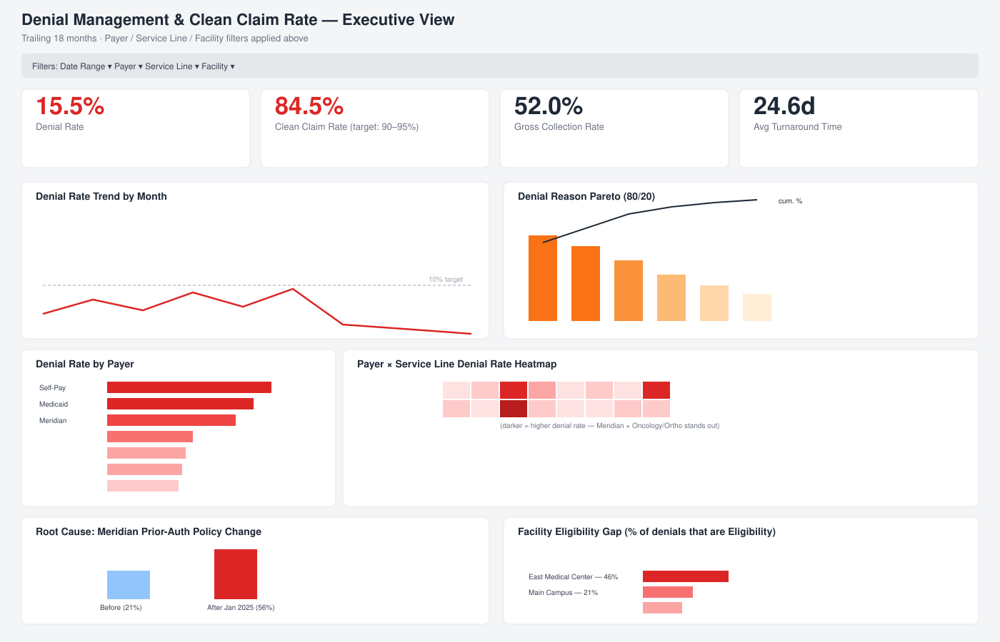

# Claims Denial & Revenue Cycle Analysis

*Strategic Healthcare BI Analyst Portfolio*

**Analyzing denial rates by payer, service line, and reason code to identify
root causes and quantify opportunities to improve clean claim rate.**

Revenue cycle performance is one of the biggest recurring pain points in
hospital and payer operations — every point of denial rate is real cash
sitting in A/R (or written off entirely) and real staff time spent on rework.
This project builds a full analyst workflow around that problem: a claims
dataset, a SQL layer that computes the core revenue-cycle KPIs, and a Tableau
dashboard build-out — ending in a prioritized, dollar-quantified list of root
causes and fixes.

📄 **[Read the full findings & recommendations →](docs/findings.md)**
📊 **[View the live dashboard page →](dashboard.html)** *(once deployed to GitHub Pages)*

## Headline result

| KPI | Value |
|---|---|
| Denial Rate | **15.5%** (target: <10%) |
| Clean Claim Rate | **84.5%** (target: 90–95%) |
| Gross Collection Rate | **52.0%** |
| Avg. Turnaround Time (denied vs. clean) | **51.6 days vs. 20.5 days** |
| Billed charges denied on first pass | **$8.24M** |

The analysis traces this gap to three specific, ownable root causes — a
payer's prior-authorization policy change, a clinical documentation gap in
one service line, and a front-desk eligibility-verification gap at one
facility — rather than leaving it as a generic "denials are up" observation.
See [`docs/findings.md`](docs/findings.md) for the full breakdown.



## Skills demonstrated

- **KPI design** — denial rate, clean claim rate, (gross) collection rate,
  turnaround time, recovery rate, defined the way revenue cycle leadership
  actually tracks them
- **SQL** — star-schema data modeling, window functions, Pareto/cumulative-%
  analysis, cohort/before-after comparison, opportunity sizing
- **Root cause analysis** — moving from "what" (a KPI dropped) to "why"
  (a specific payer policy change, on a specific date, for a specific
  service line) and "so what" (a dollar-quantified fix)
- **Dashboarding** — Tableau data model, calculated fields, and a full
  sheet-by-sheet + layout build guide

## Tools

SQL (SQLite for a portable, zero-install demo — written in ANSI/Postgres-
compatible syntax) · Tableau · Python (pandas/numpy, for synthetic data
generation only)

## Repo structure

```
├── dashboard.html            # live dashboard page (matches site header/branding) — the one to link from projects.html
├── assets/                   # chart images used by dashboard.html
├── data/
│   ├── claims.csv          # flat fact table — 9,000 synthetic claims (Jan 2024–Jun 2025)
│   └── claims.db            # SQLite database (star schema) built from claims.csv
├── scripts/
│   ├── generate_claims_data.py       # generates the synthetic dataset (documents the embedded root causes)
│   ├── build_database.py             # loads claims.csv into the SQLite star schema
│   └── generate_dashboard_charts.py  # generates the chart images in /assets from the data
├── sql/
│   ├── 00_schema.sql             # DDL for the star schema
│   ├── 01_denial_rate.sql
│   ├── 02_clean_claim_rate.sql
│   ├── 03_collection_rate.sql
│   ├── 04_turnaround_time.sql
│   ├── 05_root_cause_analysis.sql
│   └── 06_opportunity_sizing.sql
├── tableau/
│   ├── README.md                  # data model, calculated fields, sheet-by-sheet build guide
│   └── dashboard_wireframe.svg    # target dashboard layout
├── docs/
│   ├── findings.md                # full write-up: root causes, recommendations, dollar impact
│   └── data_dictionary.md         # field-by-field definitions
└── requirements.txt
```

## About the data

This project uses a **synthetic** claims dataset (no real patient, provider,
or payer data). It was generated with a fixed random seed so it's fully
reproducible, and deliberately includes a few realistic "root causes" —
a payer prior-auth policy tightening on a specific date, a service line with
a documentation-driven denial pattern, and a facility with an eligibility-
verification gap — so the SQL and dashboard work has genuine signal to find,
the same way a real denial-management engagement would. Full details and
caveats (including the gross-vs-net collection rate distinction) are in
[`docs/data_dictionary.md`](docs/data_dictionary.md).

## Reproducing this project

```bash
pip install -r requirements.txt
python scripts/generate_claims_data.py   # writes data/claims.csv
python scripts/build_database.py          # writes data/claims.db
```

Then either:
- Run any file in `/sql` against `data/claims.db` (or import `claims.csv`
  into Postgres/SQL Server/Snowflake — the SQL is written to be portable,
  see dialect notes inline), or
- Open Tableau Desktop/Public, connect to `data/claims.csv`, and follow
  [`tableau/README.md`](tableau/README.md) to build the dashboard.

## Suggested next steps for this portfolio piece

- Build the Tableau dashboard from the guide, publish to Tableau Public, and
  swap the wireframe image in this README for a real screenshot / embedded
  link.
- Add a 1-paragraph "business impact" summary at the very top of your GitHub
  Pages site, quoting the $250K Meridian-recoverable-revenue figure — that's
  the number a hiring manager will remember.
